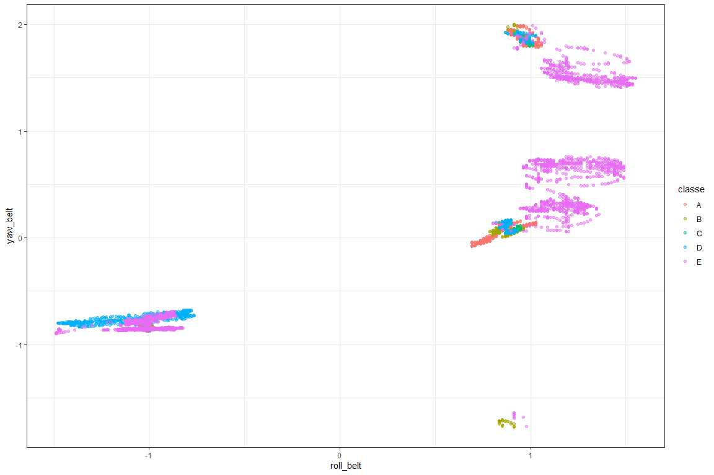

<style>
body {
text-align: justify}
</style>


```r
knitr::opts_chunk$set(echo = TRUE,
                      cache = TRUE,
                      fig.width = 12,
                      fig.height = 8,
                      warning = FALSE,
                      message = FALSE)

pacman::p_load(tidyverse, caret, doParallel)
select <- dplyr::select
```

## Introduction
The ability to automatically classify physical activity movements into categories in respect of their proper performance form (so-called qualitative activity recognition) can have potential benefits in reduction of weightlifting-related injuries.

This project is aimed at identifying correctly the type of the form in which a simple weightlifting excercise (unilateral bicep curl with dumbbell) was performed. There are 5 types of form, 1 of which was correct, the others illustrated common mistakes.

The results show a great quality of classification.

## Data preparation
First of all, I have to get the data. This particular dataset was generously provided by [@velloso2013qualitative].

```r
url_train = "https://d396qusza40orc.cloudfront.net/predmachlearn/pml-training.csv"
url_test = "https://d396qusza40orc.cloudfront.net/predmachlearn/pml-testing.csv"
download.file(url_train, "data/train_test.csv")
download.file(url_test, "data/test.csv")
```

Now I can prepare the data. I would use a simple function that removes from dataset variables with > 90% missing values. Also, I would transform our target feature "classe" into a factor variable and remove 7 id variables from both training and testing datasets [^1], since they should not be related to the data classification (i.e. performance should not depend on time of the performance and/or performer).

```r
# function to remove almost empty variables (containing > threshold NAs):
remalmempty <- function(df, threshold = 0.9) {
        naprop = sapply(df, function(x) round(sum(is.na(x)) / length(x), 2))
        return(df[naprop < threshold])
}

train_df <-
        read_csv("data/train_test.csv",
                 na = c("#DIV/0!", "NA", "", " ")) %>% # additional NA values
        remalmempty %>% # removing vars with > 90% NAs
        mutate_at("classe", ~factor(.)) %>% # recoding target feature into factor
        select(-(1:7)) # removing 7 irrelevant to performance fetures

test_df <-
        read_csv("data/test.csv") %>%
        remalmempty %>% # removing vars with > 90% NAs
        select(-(1:7)) # removing 7 irrelevant to performance fetures
```

I would partition our training dataframe into 2 smaller sets: one for model training and the other - for model performance assessment. The proportion is 3/4.

```r
# test and train split:
set.seed(2020)
inTrain <- createDataPartition(train_df$classe, p = 0.75, list = FALSE)
training <- train_df[inTrain, ]
testing <- train_df[-inTrain, ]
```

## Data exploration
For exploratory purposes I will check if there are any missing values left, I would also look at the scale of our data to decide if addtional preprocessing is needed during the modelling phase. I should also check if our classes are balanced.

```r
anyNA(training) # NA check
```

```
## [1] FALSE
```

```r
sapply(training[-ncol(training)], sd) # need scaling
```

```
##            roll_belt           pitch_belt             yaw_belt 
##          62.77622914          22.37473383          95.09814358 
##     total_accel_belt         gyros_belt_x         gyros_belt_y 
##           7.74799880           0.20922127           0.07830559 
##         gyros_belt_z         accel_belt_x         accel_belt_y 
##           0.24379535          29.66892780          28.64818556 
##         accel_belt_z        magnet_belt_x        magnet_belt_y 
##         100.49901060          64.37073179          35.95279202 
##        magnet_belt_z             roll_arm            pitch_arm 
##          66.02954593          72.99062992          30.69746376 
##              yaw_arm      total_accel_arm          gyros_arm_x 
##          71.88095414          10.51875625           1.98976565 
##          gyros_arm_y          gyros_arm_z          accel_arm_x 
##           0.85017700           0.55009597         181.93965243 
##          accel_arm_y          accel_arm_z         magnet_arm_x 
##         109.61582354         134.69781667         444.44667612 
##         magnet_arm_y         magnet_arm_z        roll_dumbbell 
##         201.72880983         326.66758144          69.81067696 
##       pitch_dumbbell         yaw_dumbbell total_accel_dumbbell 
##          37.12392949          82.60362185          10.21088424 
##     gyros_dumbbell_x     gyros_dumbbell_y     gyros_dumbbell_z 
##           0.39055373           0.48298808           0.32001600 
##     accel_dumbbell_x     accel_dumbbell_y     accel_dumbbell_z 
##          67.34001435          80.59178312         109.52785975 
##    magnet_dumbbell_x    magnet_dumbbell_y    magnet_dumbbell_z 
##         340.84044145         326.69844939         140.76805300 
##         roll_forearm        pitch_forearm          yaw_forearm 
##         108.15681017          28.15682311         103.21768452 
##  total_accel_forearm      gyros_forearm_x      gyros_forearm_y 
##           9.98155648           0.63046640           2.16410094 
##      gyros_forearm_z      accel_forearm_x      accel_forearm_y 
##           0.59612480         180.45051760         200.16693585 
##      accel_forearm_z     magnet_forearm_x     magnet_forearm_y 
##         138.74354163         347.69105151         510.71403733 
##     magnet_forearm_z 
##         371.95130890
```

```r
table(training$classe) # classes are balanced
```

```
## 
##    A    B    C    D    E 
## 4185 2848 2567 2412 2706
```

I've also made several plots, that show somewhat complicated pattern. This is just one of them:

```r
training %>%
mutate_if(is.numeric, scale) %>% 
        ggplot(aes(x = roll_belt, y = yaw_belt, color = classe))+
        geom_point(alpha = 0.5)+
        theme_bw()
```

<!-- -->

## Modelling
For modelling I chose random forest algorithm because the data does not appear to contain linear patterns and because random forest is good at predicting tasks. To speed up the process I used doParallel package.

```r
cl <- makePSOCKcluster(5)
registerDoParallel(cl)
```

To reduce the out of sample error I chose 10-times repeated 5-fold cross-validation. To account for different scales I also centered and scaled the data.

```r
# Creating object for Accuracy training:
set.seed(2020)
objControl <-
        trainControl(method = "repeatedcv",
                     number = 10,
                     repeats = 5)
rf_mdl <-
        train(classe ~ .,
              data = training,
              trainControl = objControl,
              method = "rf",
              preProcess = c("center", "scale"))
```

## Prediction

Initially, I intended to explore ensembling models, but after I checked with the confusion table, I decided not to go further with algorithm complication.

```r
confusionMatrix(predict(rf_mdl, newdata = testing), testing$classe)$table
```

```
##           Reference
## Prediction    A    B    C    D    E
##          A 1394    9    0    0    0
##          B    1  936    6    0    0
##          C    0    4  848   14    0
##          D    0    0    1  789    1
##          E    0    0    0    1  900
```

```r
# I am happy with this result
stopCluster(cl)
```

Thus, my estimate of the out of sample error with 95% CI is anywhere between 99,0% to 99,5%:

```r
# Expected out of sample error:
round(confusionMatrix(predict(rf_mdl, newdata = testing), testing$classe)$overal[c(1, 3, 4)], 3)
```

```
##      Accuracy AccuracyLower AccuracyUpper 
##         0.992         0.990         0.995
```

[^1]: 7 id variables are the username of the performer, 3 types of timestamp and 2 variables of window.

## References
